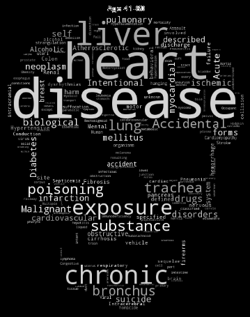

# Mortality-in-the-US

Exploratory and descriptive visualizations of U.S. mortality data in 2005, 2010, and 2015. 

Data retrieved from: Death in the United States (Kaggle) dataset:
2005_data.csv, 2010_data.csv, and 2015_data.csv, 2005_codes.json, 2010_codes.json, 2015_codes.json

To generate word cloud, requires a skull.png image mask.
